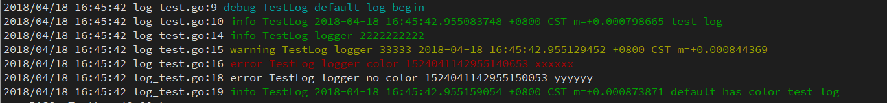

## crab log  
crab log 是一个轻量级log库，支持不同级别不同颜色输出，按天滚动输出日志文件等常用日志功能  

## Example  
[](log_test.go)  

```go
package main                                                                                                                                                                                                                                              

import (
    "time"

    "github.com/dearcode/crab/log"
)

func main() {
    log.Debug("default log begin")
    log.Infof("%v test log", time.Now())

    l := log.NewLogger()
    l.Debug("logger 1111111111")
    l.Info("logger 2222222222")
    l.Warningf("logger 33333 %v", time.Now())
    l.Errorf("logger color %v xxxxxx", time.Now().UnixNano())

    //关闭颜色显示
    l.SetColor(false)

    l.Errorf("logger no color %v yyyyyy", time.Now().UnixNano())
    log.Infof("%v default has color test log", time.Now())

    //指定输出文件
    l.SetOutputFile("./vvv.log").SetRolling(true)
    l.Info(time.Now())

}
```  

## Installing

### Using *go get*
```bash
    $ go get github.com/dearcode/crab/log  
```
After this command *log* is ready to use. Its source will be in:  
```bash
    $GOPATH/src/github.com/dearcode/crab/log  
```

You can use `go get -u` to update the package.  

## Documentation  

For docs, see http://godoc.org/github.com/dearcode/crab/log or run:  
```bash
    $ godoc github.com/dearcode/crab/log  
```

